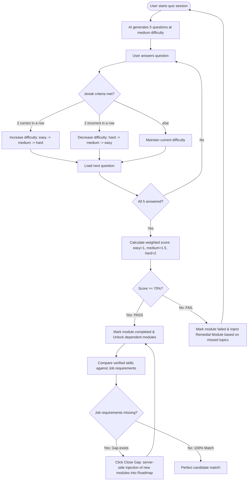
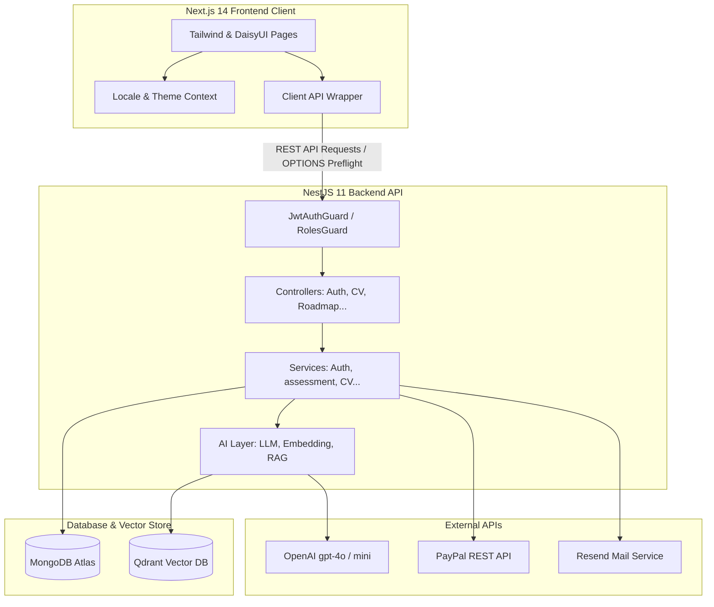
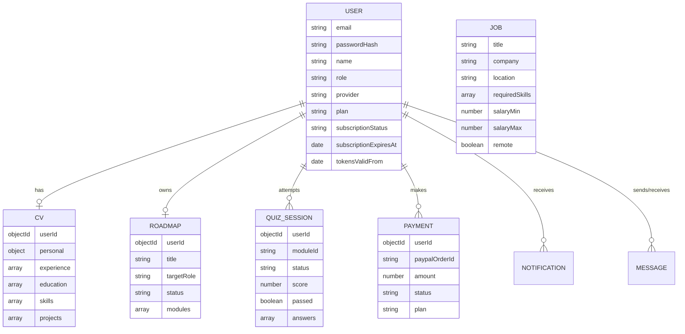

# SmartRoadmap 🚀

> AI-assisted learning paths and talent matching platform — Next.js 14 & NestJS 11 monorepo utilizing OpenAI curriculum generation, adaptive assessments, and secure transaction workflows.

---

## 1. Application Overview

**SmartRoadmap** is an end-to-end career preparation and recruiting platform designed to bridge the gap between education and employment. The application acts as a personalized career companion for learners and a pre-vetted candidate pipeline for recruiters.

### Core Functionality

- **CV Parsing & Enhancement:** Users upload résumé PDFs which are automatically parsed into structured profiles. The built-in AI enhances experience bullet points to increase professional impact.
- **AI Curriculum Designer:** Based on a desired target role and current skills, the system uses OpenAI to generate a custom visual learning roadmap composed of modules with estimates and visual tree coordinates.
- **Adaptive Skill Assessment:** Each learning module features an adaptive quiz. The questions rise or lower in difficulty based on consecutive correct or incorrect answers. Scores are weighted by question difficulty.
- **Remedial Feedback Loop:** If a learner fails a module assessment (scoring below 70%), the system automatically creates a targeted _Remedial Module_ focusing specifically on the missed questions so the user is never left stuck.
- **Skill-Gap Integration:** Candidates can view job matches and compare their _verified_ skills (earned from passing quizzes) against job requirements. The system lets users close match gaps by instantly injecting the missing requirements back into their learning roadmap.
- **Recruiter Pipeline:** Employer/Company accounts can browse pre-vetted, verified candidates scored by their actual quiz performance and course completion rates.
- **Premium Subscriptions:** Access is gated by plan levels (`free`, `pro_learner`, `company_tier`) using a secure PayPal transaction flow with server-side price verification and signed webhook capture.

### User Journey & Adaptive Learning Loop



---

## 2. System Architecture

The application is structured as a monorepo managed with **Turborepo** and **npm workspaces**.



### Component Details

- **Frontend (`apps/web`):** Built with **Next.js 14** using the App Router. Interface elements are styled using **Tailwind CSS** and **DaisyUI**. Features full Internationalization (English/Arabic) with logical margins and RTL grid/spacing support.
- **Backend (`apps/api`):** Built on **NestJS 11** utilizing modular Dependency Injection. Security is _deny-by-default_ via a global `JwtAuthGuard` and role validation via `RolesGuard`.
- **Shared Package (`packages/shared`):** Contains shared schemas validated with **Zod** and compile-time TypeScript types, ensuring type safety and payload contract synchronization across both front and backend.
- **Generative Layer:** Centralized under `ai/` services. All LLM calls degrade gracefully to terminating mock functions in offline development contexts so the application remains functional without internet or API credentials.
- **Vector Database:** Uses **Qdrant** for semantic search embeddings. Cosine-similarity collections are verified and created on boot.

---

## 3. Data Model

The database is powered by MongoDB. Schema associations are defined via Mongoose ObjectIDs.

### Entity-Relationship Diagram



### 3.1 User (`UserSchema`)

Represents accounts (learners, companies, admins), billing entitlements, and security boundaries.

- `email` (String, unique, indexed): Primary identifier.
- `passwordHash` (String, select: false): Hashed credentials (bcrypt, 12 rounds).
- `name` (String): Display name.
- `role` (Enum: `learner` | `company` | `admin`): Security boundaries.
- `provider` (Enum: `local` | `google`): Prevents login injection on Google-linked profiles.
- `isVerified` (Boolean): Email verification state.
- `plan` (Enum: `free` | `pro_learner` | `company_tier`): Active billing tier.
- `subscriptionStatus` (Enum: `inactive` | `active` | `expired`): Entitlement state.
- `subscriptionExpiresAt` (Date): Billing period expiry.
- `tokensValidFrom` (Date): Time indicator to invalidate older sessions (force logout on reset).
- `refreshTokenHashes` (Array of Strings, select: false): Active devices' hashed refresh tokens.

### 3.2 CV (`CvSchema`)

Maintains unstructured parsed résumé data.

- `userId` (ObjectID, ref: 'User', unique): CV owner.
- `personal` (Sub-document): Personal details (name, email, phone, website, photoUrl, summary).
- `experience` (Array of Sub-documents): Professional history (company, role, dates, description).
- `education` (Array of Sub-documents): Academic history (school, degree, dates).
- `skills` (Array of Strings): Key skill tags.
- `projects` (Array of Sub-documents): Portfolio links and details.
- `references` (Array of Sub-documents): Professional contacts.

### 3.3 Roadmap (`RoadmapSchema`)

Custom curriculum paths designed by the system designer.

- `userId` (ObjectID, ref: 'User'): Learning path owner.
- `title` (String): Learning path display title.
- `targetRole` (String): Career goal.
- `totalEstimatedHours` (Number): Sum of all module estimates.
- `status` (Enum: `active` | `archived`): Visibility flag.
- `modules` (Array of ModuleItems): Custom curriculum node array.
  - `id` (String): Unique module node ID.
  - `title` (String): Module title.
  - `description` (String): Learning outcome.
  - `difficulty` (Enum: `beginner` | `intermediate` | `advanced`).
  - `estimatedHours` (Number): Hours to complete.
  - `topics` (Array of Strings): Subtopics.
  - `prerequisites` (Array of Strings): Prerequisites' Module IDs.
  - `status` (Enum: `locked` | `in_progress` | `completed` | `failed`).
  - `positionX` / `positionY` (Number): Flowchart canvas coordinates.

### 3.4 Quiz Session (`QuizSessionSchema`)

Handles active testing parameters.

- `userId` (ObjectID, ref: 'User'): Candidate under test.
- `moduleId` (String): Associated module being assessed.
- `status` (Enum: `in_progress` | `completed`).
- `score` (Number): Final weighted percentage (0-100).
- `passed` (Boolean): Passed criteria indicator (score >= 70).
- `answers` (Array of QuizAnswerItems): Captured responses.
  - `question` (String): Target question text.
  - `userAnswer` (String): Option chosen.
  - `correct` (Boolean): Correctness result.
  - `difficulty` (Enum: `easy` | `medium` | `hard`): Question difficulty level.
  - `timeTaken` (Number): Duration in seconds.

### 3.5 Payment (`PaymentSchema`)

Tracks billing orders created for checkout validation.

- `userId` (ObjectID, ref: 'User'): Buyer.
- `paypalOrderId` (String, unique): PayPal order transaction identifier.
- `amount` (Number): Order total.
- `status` (Enum: `created` | `completed` | `failed`).
- `plan` (Enum: `pro_learner` | `company_tier`).

---

## 4. User Roles & Permissions

Access is strictly enforced using guards. The permission rules per role are defined as follows:

| Feature Route / Operation                          | Learner | Company | Admin |
| -------------------------------------------------- | :-----: | :-----: | :---: |
| **Authentication & Profile**                       |         |         |       |
| Register, Login, Token Refresh                     |   ✅    |   ✅    |  ✅   |
| Update Profile Details (Name, Bio, Theme)          |   ✅    |   ✅    |  ✅   |
| Change User Roles / Modify Plan                    |   ❌    |   ❌    |  ✅   |
| **Learning Path (Roadmap)**                        |         |         |       |
| Generate Initial Roadmap                           |   ✅    |   ❌    |  ✅   |
| View Own Roadmap / Modules Progress                |   ✅    |   ❌    |  ✅   |
| View Other User's Roadmap                          |   ❌    |   ❌    |  ✅   |
| **Assessments (Quizzes)**                          |         |         |       |
| Start Module Quiz Session                          |   ✅    |   ❌    |  ✅   |
| Answer Quiz Questions                              |   ✅    |   ❌    |  ✅   |
| **CV Builder**                                     |         |         |       |
| Upload PDF Resume / AI Parser                      |   ✅    |   ❌    |  ✅   |
| AI Enhance CV Description Bullet                   |   ✅    |   ❌    |  ✅   |
| View Other Candidates' CV Profiles                 |   ❌    |   ✅    |  ✅   |
| **Job Search & Matching**                          |         |         |       |
| Browse Jobs List                                   |   ✅    |   ✅    |  ✅   |
| Get Custom Job Matching / Skill Gaps               |   ✅    |   ❌    |  ✅   |
| Close Skill Gap (Inject missing skills to roadmap) |   ✅    |   ❌    |  ✅   |
| Create Job Postings (Add Listings)                 |   ❌    |   ✅    |  ✅   |
| View Candidate Search Pipeline                     |   ❌    |   ✅    |  ✅   |
| **Billing / Payments**                             |         |         |       |
| Checkout & Subscribe to Pro                        |   ✅    |   ✅    |  ✅   |
| capture/verify order                               |   ✅    |   ✅    |  ✅   |

---

## 5. Current Implementation Status

### 5.1 Operational Features (Done ✅)

1. **Security & Session Layer:** Complete JWT access/refresh token rotation, httpOnly cookie isolation, token replay theft detection, bcrypt password hashing, and Google Identity token verification.
2. **Access Control:** Global global route guard (deny-by-default), resource ownership verification via `assertSelfOrAdmin()`, and roles guard gating.
3. **Roadmap Curriculum & Adaptivity:** AI-driven curriculum generation via OpenAI, auto-unlocking of subsequent modules, and fail-safe generation of shorter _remedial modules_ based on missed questions.
4. **Adaptive Assessments:** Assessment sessions generating dynamically balanced quizzes adjusting difficulty relative to response streaks, applying weighted score metrics.
5. **CV AI Upload & Builder:** Structured parser via PDF text extractor + OpenAI JSON model fallback, AI description enhancer, and a structured split UI component system.
6. **Entitlements Billing:** PayPal API integration determining pricing server-side from plans, verification checks on amounts, and cryptographic signature validation on incoming transaction webhooks.
7. **Bilingual Layout & Theme support:** Logical RTL/LTR layout adjustment for Arabic and English locales, alongside dark/light toggle options (DaisyUI).
8. **Test Resiliency:** Comprehensive test environment featuring validation schemas (`env.validation.ts`) and a 53-point API end-to-end smoke test suite (`npm run smoke`).

### 5.2 Not Implemented / Excluded (❌)

- **Adzuna Job Scraping:** The system relies on seeded jobs in MongoDB. Active scrapers are not wired.
- **BullMQ/Redis:** Job indexing is synchronous. Offloaded background queues are not implemented.
- **React Flow Interface:** The visual tree graph in the frontend is rendered using a custom canvas layout rather than third-party React Flow node packages.

---

## Quick Start (Local Development)

### 1. Configure Environments

Copy the example configurations and review/populate variables:

```bash
cp .env.example .env
cp .env.example apps/api/.env
cp .env.example apps/web/.env
```

Ensure `FRONTEND_URL` is set to `http://localhost:3001` to allow correct CORS headers.

### 2. Launch Services

Start the development stack:

```bash
npm install
npm run dev
```

### 3. Verify System Tests

Run the automated end-to-end smoke test suite:

```bash
npm run smoke
```

_(Tests include rate limit simulations and account takeover checks)_
